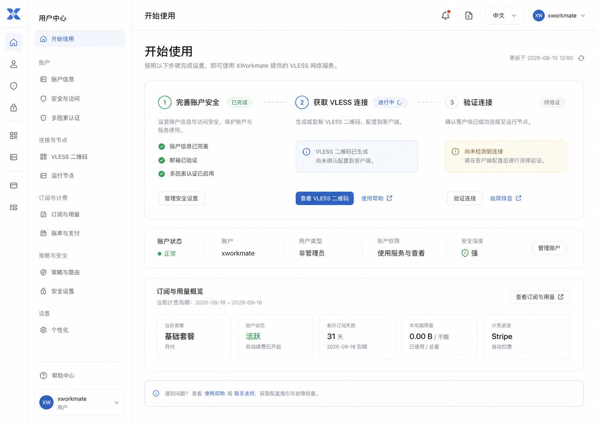

# 非管理员用户中心：开始使用

## 交互与数据约束

- 左侧导航默认是窄图标栏；使用顶栏的展开/收起控制固定切换，不依赖悬停。
- 首屏按「账户安全 → 获取 VLESS 连接 → 验证连接」引导，状态由账户、UUID 与现有服务端接口决定。
- 所有显示的订阅、节点、策略与安全信息继续由原有 API 读取；接口未返回的数据明确显示等待或不可用状态，不制作示例指标。
- 主操作进入现有连接面板或 MFA 设置页，避免复制新的业务流程。
