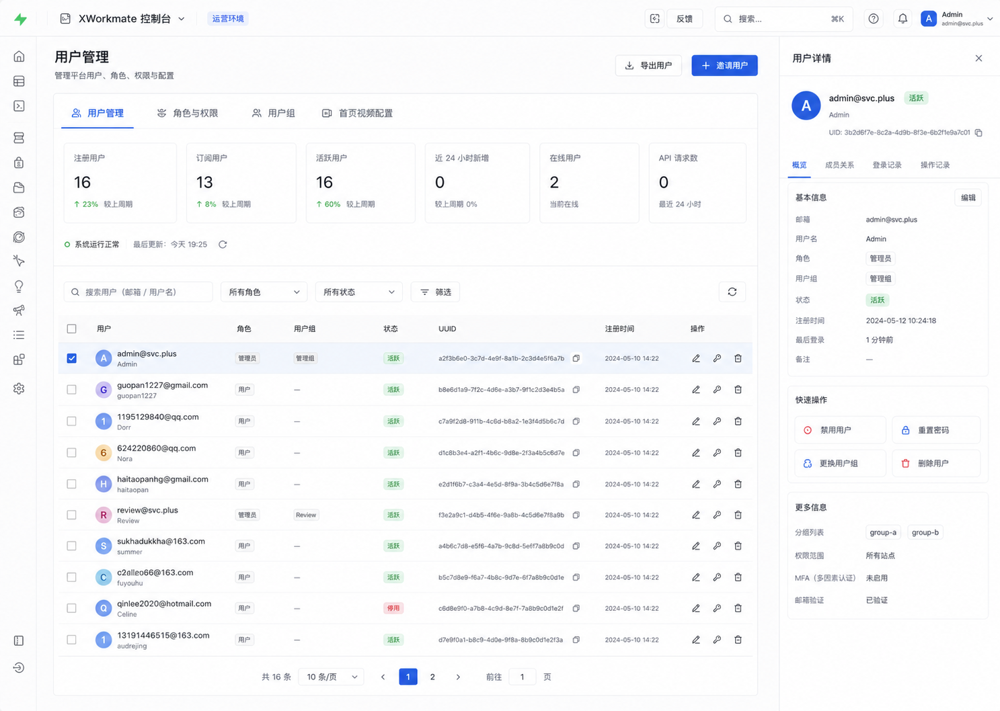

# 用户管理控制台参考

## 实施原则

- 默认使用 56px 超窄图标边栏；鼠标悬停或顶部控制可展开为完整导航。
- 管理页按「页面标题 → 四项指标 → 检索与筛选 → 用户表格 → 固定详情检查器」组织。
- 用户详情检查器承载角色修改、UUID 重置、启停和删除等已有操作；不引入新的后端接口。
- 权限矩阵、用户组和首页视频配置保留为页面内标签，避免默认把所有管理工作堆在同一长页。
